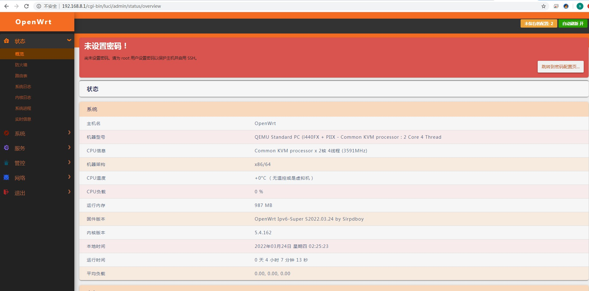
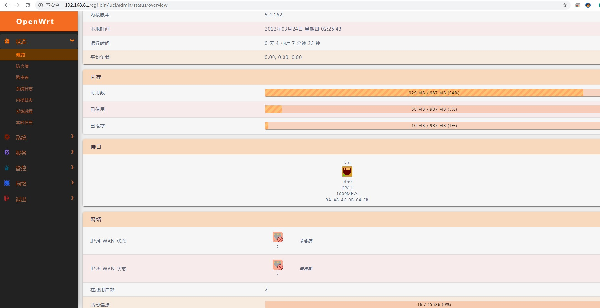

[](#解决-github-网页上图片显示失败的问题) [](https://t.me/joinchat/AAAAAEpRF88NfOK5vBXGBQ)

[myautocore 加强版预览信息OPENWRT专用](https://github.com/sirpdboy/myautocore)
======================
请 **认真阅读完毕** 本页面，本页面包含注意事项和如何使用。

## 功能说明：

###  来源LEAN大的  autocore 脚本。

###  本着人人为我，我为人人的原则，增加温度，类型，网卡MAC，时间等更多详细内容显示。不敢独享，特分享出来，为OPENWRT添砖加瓦。





### 将myautocore添加至 LEDE/OpenWRT 源码的方法。

### 下载源码方法：

##由于习惯问题，会和LEAN大中的autocore冲突 ，建议编译前先删除：rm -rf package/lean/autocore

 ```Brach
 
    # 下载源码

    git clone https://github.com/sirpdboy/myautocore package/myautocore
	
    make menuconfig
	
 ``` 
 
### 配置菜单

 ```Brach
 
    make menuconfig
	
	# 找到 LuCI -> Applications, 选择 myautocore, 保存后退出。
	
 ``` 
### 编译

 ```Brach 
 
    # 编译固件
	
    make package/myautocore/compile V=s
 ```

## 说明 [](#说明-)

源码来源：https://github.com/sirpdboy/myautocore
